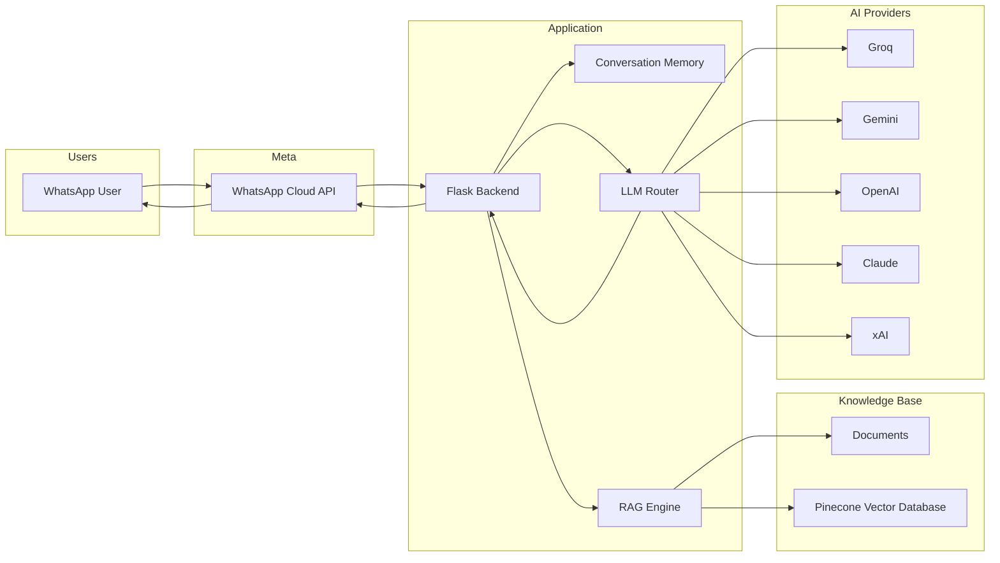
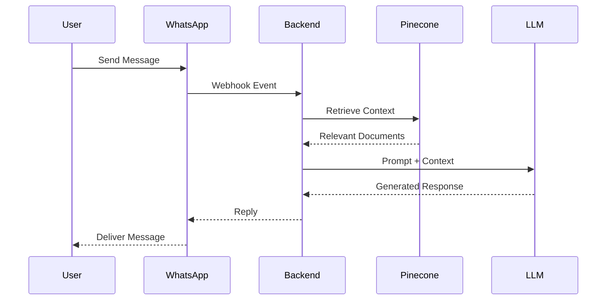

# WhatsApp AI Assistant

Production-ready WhatsApp AI Assistant powered by Retrieval-Augmented Generation (RAG), intelligent LLM routing, conversation memory, and document-based question answering.

<p align="center">


</p>

---

## Overview

WhatsApp AI Assistant is an open-source platform for building intelligent WhatsApp-based assistants powered by modern Large Language Models and Retrieval-Augmented Generation (RAG).

The system enables organizations to connect their private knowledge base to WhatsApp, allowing users to receive accurate, context-aware responses directly inside WhatsApp conversations.

Key capabilities include:

* Document-based question answering
* Multi-provider LLM routing
* Conversation memory
* Pinecone-powered semantic search
* WhatsApp Cloud API integration
* Docker-based deployment
* Extensible architecture

---

## Why This Project?

Most WhatsApp AI assistants rely on a single AI provider.

This project was designed with:

* Vendor independence
* Cost optimization
* High availability
* Modular architecture
* Production readiness

The built-in routing layer allows the application to automatically switch between providers whenever a model becomes unavailable or reaches usage limits.

---

## Architecture



---

## Request Flow



---

## Features

| Feature              | Description                                               |
| -------------------- | --------------------------------------------------------- |
| Document QA          | Answer questions from PDFs, TXT, DOCX and other documents |
| RAG Retrieval        | Context-aware responses from your knowledge base          |
| WhatsApp Integration | Native WhatsApp Cloud API support                         |
| Conversation Memory  | Persistent user chat history                              |
| Multi-Provider AI    | Groq, Gemini, OpenAI, Claude, xAI                         |
| Automatic Fallback   | Failover between LLM providers                            |
| Docker Deployment    | Containerized production deployment                       |
| Admin Dashboard      | Manage uploaded documents                                 |
| Cost Optimization    | Prioritizes lower-cost inference providers                |
| Extensible Design    | Easy integration of additional AI providers               |

---

## Technology Stack

| Layer           | Technology                        |
| --------------- | --------------------------------- |
| Backend         | Flask, Python 3.12                |
| AI Framework    | LangChain                         |
| Vector Database | Pinecone                          |
| Database        | SQLite, SQLAlchemy                |
| Messaging       | WhatsApp Cloud API                |
| Deployment      | Docker, Docker Compose            |
| AI Providers    | Groq, Gemini, OpenAI, Claude, xAI |

---

## LLM Routing Strategy

The assistant follows a cost-first routing approach:

1. Groq (Llama 3)
2. Google Gemini
3. OpenAI
4. Claude
5. xAI

This strategy helps reduce inference costs while maintaining reliability and availability.

---

## Quick Start

### Clone Repository

```bash
git clone https://github.com/cleven12/whatsapp-ai-assistant.git

cd whatsapp-ai-assistant
```

### Configure Environment

```bash
cp .env.example .env
```

Update your `.env` file:

```env
WHATSAPP_TOKEN=

WHATSAPP_PHONE_NUMBER_ID=

WHATSAPP_VERIFY_TOKEN=

GROQ_API_KEY=

PINECONE_API_KEY=

PINECONE_INDEX_NAME=
```

### Run with Docker

```bash
docker compose up --build
```

Application:

```text
http://localhost:5000
```

---

## Webhook Configuration

1. Create a Meta Developer application.
2. Configure WhatsApp Cloud API.
3. Expose your application using ngrok.

```bash
ngrok http 5000
```

4. Set the generated HTTPS URL as your webhook endpoint.
5. Use the same verification token configured in `.env`.
6. Subscribe to the `messages` webhook event.

---

## Project Structure

```text
whatsapp-ai-assistant/

├── app/
│   ├── routes/
│   ├── services/
│   ├── rag/
│   ├── llm/
│   ├── models/
│   └── templates/
│
├── uploads/
├── static/
├── docker/
│
├── requirements.txt
├── Dockerfile
├── docker-compose.yml
├── .env.example
└── app.py
```

---

## Deployment

Supported deployment targets:

* Ubuntu Server
* Debian
* DigitalOcean
* AWS EC2
* Oracle Cloud
* Hetzner
* Railway
* Render
* Docker VPS Environments

Recommended deployment:

```bash
docker compose up -d
```

---

## Security

* Environment-based secrets management
* Webhook verification support
* Docker container isolation
* No credentials stored in source control
* Modular architecture for secure deployments

---

## Contributing

Contributions are welcome.

1. Fork the repository
2. Create a feature branch
3. Commit your changes
4. Push to your branch
5. Open a Pull Request

---

## 💖 Support This Project

If you find this project useful and would like to support its development, please consider supporting my work! Your support helps keep the project maintained and covers API/Infrastructure costs.

<p align="center">
  <a href="https://snippe.me/pay/support-cleven">
    
  </a>
</p>

---

## 📄 License

Distributed under the MIT License.

See the `LICENSE` file for details.

---

<p align="center">
Built for scalable AI-powered customer support and knowledge retrieval on WhatsApp.
</p>
