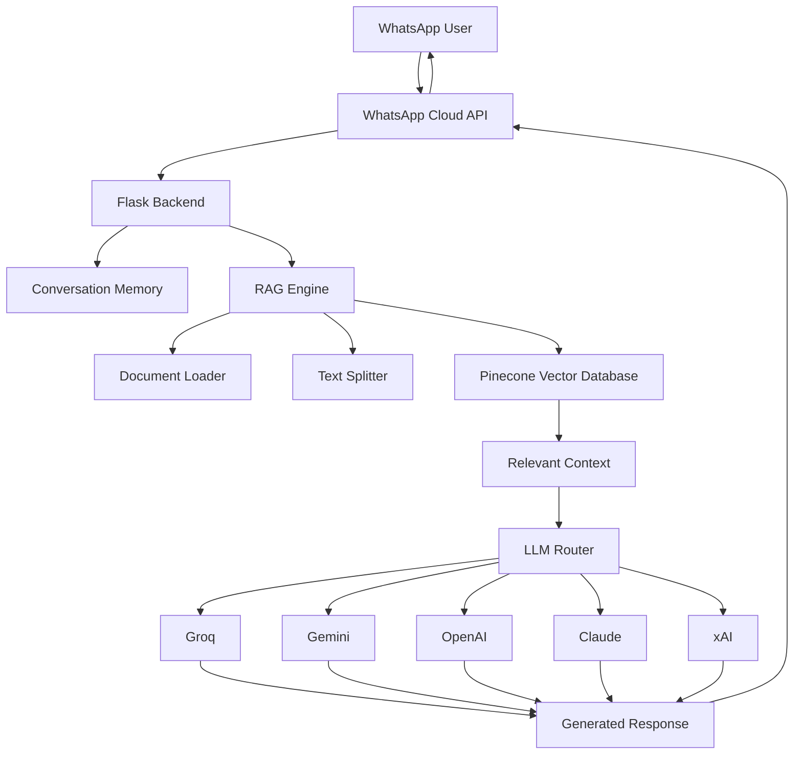
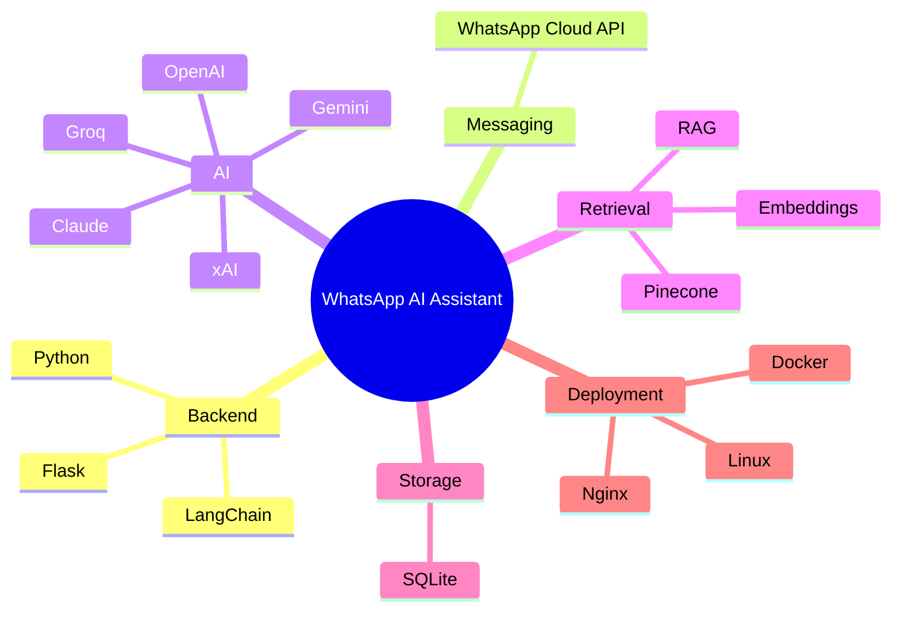
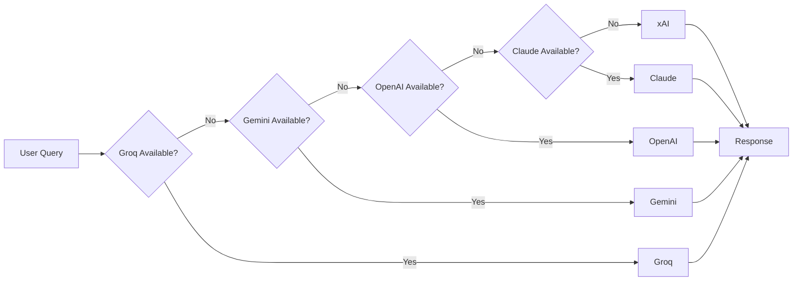
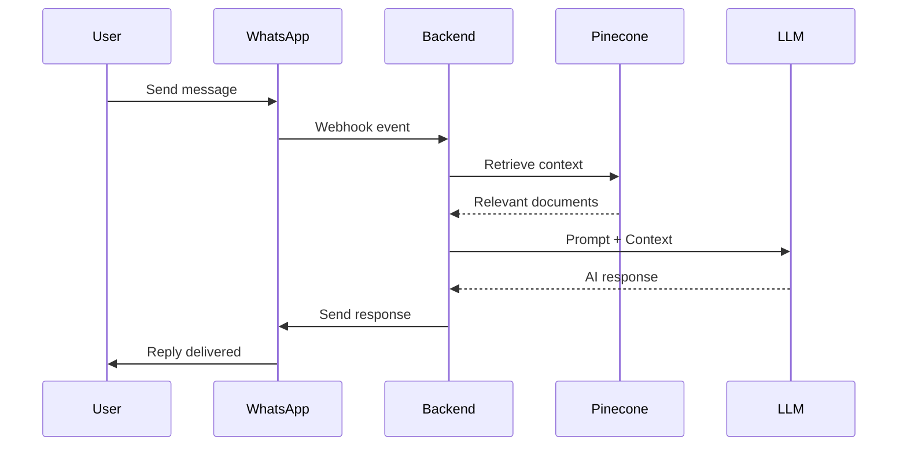

---

# WhatsApp AI Assistant

> Production-ready WhatsApp AI Assistant powered by Retrieval-Augmented Generation (RAG), intelligent LLM routing, conversation memory, and document-based question answering.

<p align="center">


</p>

---

## Overview

WhatsApp AI Assistant is a scalable AI-powered customer support and knowledge assistant that enables users to interact with your organization directly through WhatsApp.

The system combines:

* Retrieval-Augmented Generation (RAG)
* Multi-provider LLM routing
* Vector search
* Conversation memory
* Document management dashboard
* WhatsApp Cloud API integration

to deliver accurate and cost-efficient responses grounded in your own knowledge base.

---

## Architecture



---

## Technology Stack



---

## Key Features

| Feature               | Description                               |
| --------------------- | ----------------------------------------- |
| RAG Search            | Answers generated from your own documents |
| WhatsApp Integration  | Native WhatsApp Cloud API support         |
| Multi-LLM Routing     | Automatic provider fallback               |
| Conversation Memory   | Maintains context across chats            |
| Document Management   | Upload and manage PDFs, TXT files         |
| Cost Optimization     | Uses lower-cost models first              |
| Docker Support        | Easy deployment                           |
| Scalable Architecture | Suitable for production workloads         |

---

## LLM Fallback Strategy



---

## Project Structure

```text
whatsapp-ai-assistant/
│
├── app/
│   ├── routes/
│   ├── services/
│   ├── rag/
│   ├── llm/
│   ├── models/
│   └── templates/
│
├── uploads/
├── vector_store/
├── static/
│
├── docker/
│
├── requirements.txt
├── Dockerfile
├── docker-compose.yml
├── .env.example
└── app.py
```

---

## Request Processing Flow



---

## Quick Start

```bash
git clone https://github.com/cleven12/whatsapp-ai-assistant.git

cd whatsapp-ai-assistant

cp .env.example .env

docker compose up --build
```
