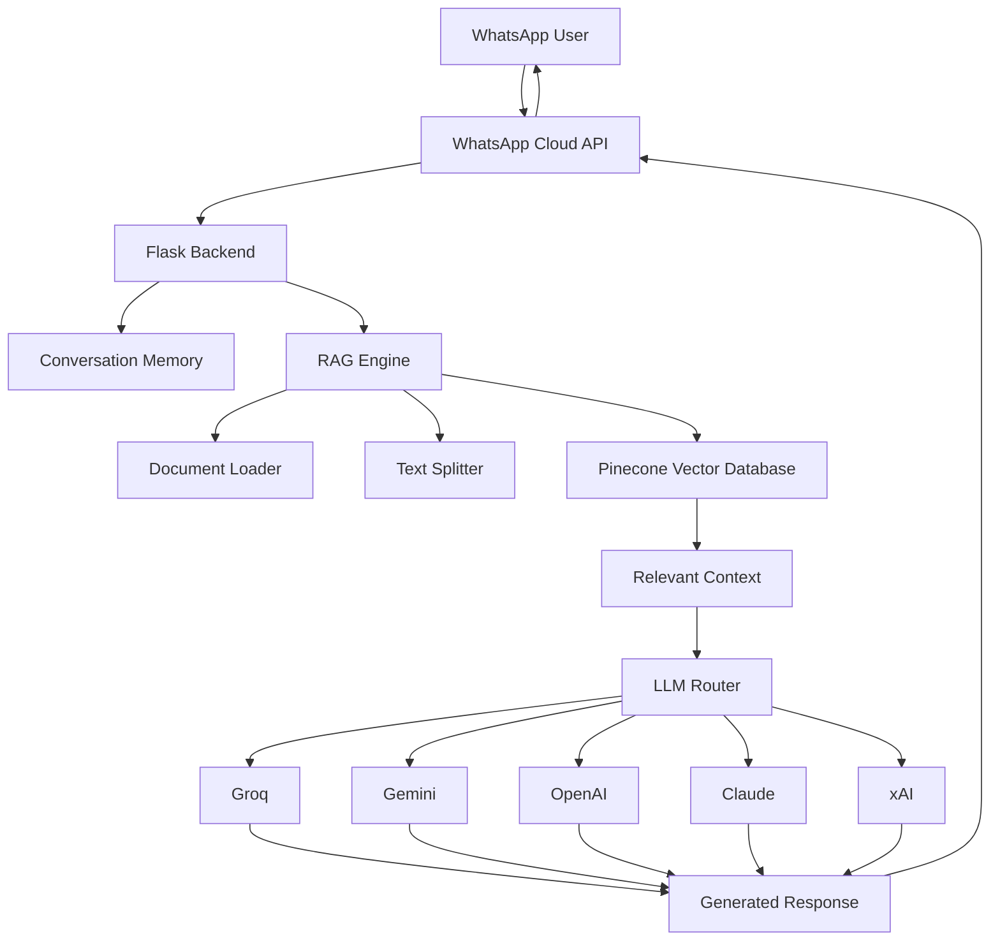

# 🤖 WhatsApp AI Assistant

> Production-ready WhatsApp AI Assistant powered by Retrieval-Augmented Generation (RAG), intelligent LLM routing, conversation memory, and document-based question answering.

<p align="center">


</p>

---

## 📖 Overview

WhatsApp AI Assistant is a scalable AI-powered customer support and knowledge assistant that enables users to interact with your organization directly through WhatsApp. It uses a **cost-first LLM routing strategy**, prioritizing fast and cheap models like Llama 3 on Groq before falling back to more powerful models like GPT-4o or Claude 3.5 Sonnet.

The system features **Retrieval-Augmented Generation (RAG)**, allowing it to provide accurate, grounded answers based on your private document library stored in a Pinecone vector database.

---

## 🏗 Architecture



---

## 🛠 Technology Stack

- **Backend**: Flask (Python 3.12)
- **AI Orchestration**: LangChain
- **Vector Database**: Pinecone (Serverless)
- **Primary Database**: SQLite (via SQLAlchemy)
- **Messaging**: WhatsApp Cloud API (Meta)
- **Deployment**: Docker & Docker Compose
- **LLM Providers**: Groq, Google Gemini, OpenAI, Anthropic, xAI

---

## ✨ Key Features

| Feature               | Description                               |
| --------------------- | ----------------------------------------- |
| **RAG Search**        | Context-aware answers from your private documents. |
| **Smart Routing**     | Automatic fallback through multiple LLM providers. |
| **Memory**            | SQLite-backed conversation history per user. |
| **WhatsApp Native**   | Full integration with WhatsApp Cloud API. |
| **Cost Optimized**    | Uses Groq/Llama3 primarily to minimize API costs. |
| **Dockerized**        | One-command setup with `docker-compose`. |

---

## 🔄 LLM Fallback Strategy

The assistant follows a strict priority chain to balance cost and capability:
1. **Groq (Llama 3 70B)**: Ultra-fast and currently free/cheap.
2. **Google Gemini 1.5 Flash**: High speed, low cost, large context.
3. **OpenAI GPT-4o Mini**: Reliable, industry standard fallback.
4. **Anthropic Claude 3.5 Sonnet**: High intelligence for complex queries.
5. **xAI (Grok)**: Emerging alternative.

---

## 🚀 Quick Start

### 1. Prerequisites
- [Meta Developer Account](https://developers.facebook.com/) with WhatsApp Cloud API setup.
- [Pinecone API Key](https://www.pinecone.io/).
- API Keys for your chosen LLM providers (Groq is highly recommended).

### 2. Installation
```bash
git clone https://github.com/cleven12/whatsapp-ai-assistant.git
cd whatsapp-ai-assistant
cp .env.example .env
```

### 3. Configuration
Edit the `.env` file with your credentials:
```env
WHATSAPP_TOKEN=your_token
WHATSAPP_PHONE_NUMBER_ID=your_id
WHATSAPP_VERIFY_TOKEN=your_chosen_verify_token

GROQ_API_KEY=your_key
PINECONE_API_KEY=your_key
PINECONE_INDEX_NAME=whatsapp-rag
```

### 4. Launch with Docker
```bash
docker compose up --build
```
The app will be available at `http://localhost:5000`.

---

## 🔗 Webhook Configuration

1. Use **ngrok** to expose your local server: `ngrok http 5000`.
2. In the Meta Developer Portal, set the Webhook URL to `https://your-ngrok-url/webhook/`.
3. Set the **Verify Token** to the same value as `WHATSAPP_VERIFY_TOKEN` in your `.env`.
4. Subscribe to the `messages` field under Webhook fields.

---

## 📂 Project Structure

```text
whatsapp-ai-assistant/
│
├── app/
│   ├── routes/          # Webhook and Dashboard endpoints
│   ├── services/        # WhatsApp API integration
│   ├── rag/             # Pinecone retrieval logic
│   ├── llm/             # Fallback routing logic
│   ├── models/          # Database schemas (User, Message)
│   └── templates/       # Dashboard HTML
│
├── uploads/             # Temporary document storage
├── vector_store/        # Local vector index (optional)
├── static/              # CSS/JS for dashboard
├── docker/              # Docker configuration files
│
├── requirements.txt
├── Dockerfile
├── docker-compose.yml
├── .env.example
└── app.py               # Application entry point
```

---

## 🤝 Contributing

Contributions are welcome! Please feel free to submit a Pull Request.

1. Fork the Project
2. Create your Feature Branch (`git checkout -b feature/AmazingFeature`)
3. Commit your Changes (`git commit -m 'Add some AmazingFeature'`)
4. Push to the Branch (`git push origin feature/AmazingFeature`)
5. Open a Pull Request

---

## 📄 License

Distributed under the MIT License. See `LICENSE` for more information.

---
<p align="center">Made with ❤️ for the AI community</p>
